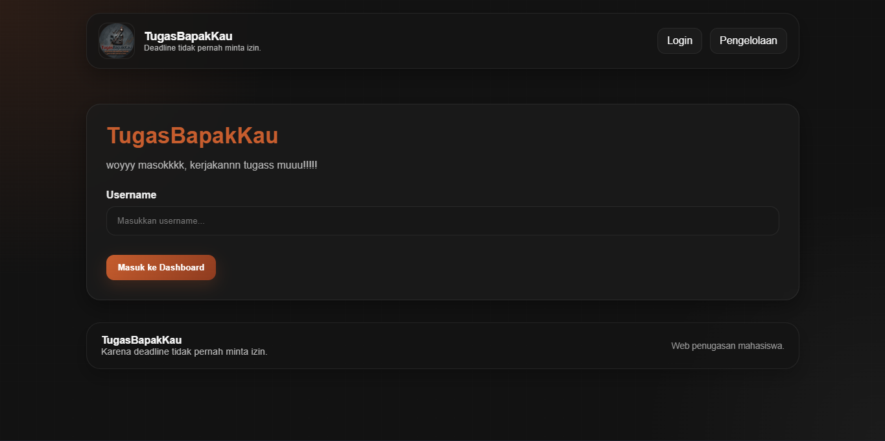
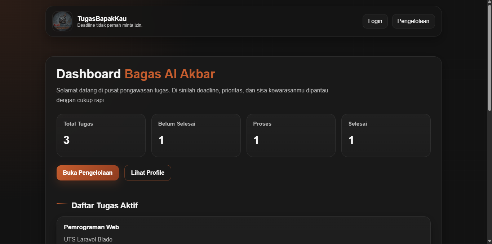
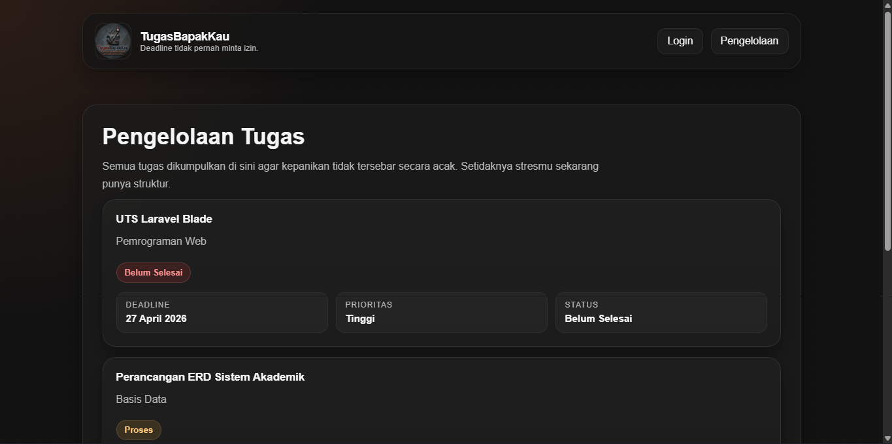
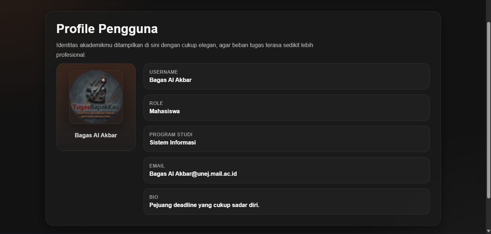

# TugasBapakKau

**TugasBapakKau** adalah website pengelolaan tugas mahasiswa berbasis **Laravel** yang dibuat untuk memenuhi tugas **UTS Pemrograman Web**.

Website ini menampilkan simulasi alur login sederhana, dashboard ringkasan tugas, halaman pengelolaan tugas, dan profile pengguna.

## Tema Website

**TugasBapakKau**
*Karena deadline tidak pernah minta izin.*

---

## Fitur Utama

- Halaman **Login** untuk memasukkan username
- Halaman **Dashboard** yang menampilkan:
  - username pengguna
  - total tugas
  - jumlah tugas berdasarkan status
  - daftar tugas aktif
- Halaman **Pengelolaan Tugas** yang menampilkan seluruh daftar tugas
- Halaman **Profile** yang menampilkan data pengguna
- Menggunakan **layout utama Blade**
- Menggunakan **Blade component** untuk navbar dan footer
- Data tugas dikirim dari **controller** ke **view**
- Menampilkan data tugas menggunakan **loop `@foreach`**

---

## Teknologi yang Digunakan

- **Laravel**
- **PHP**
- **Blade Template Engine**
- **HTML**
- **CSS**

---

## Struktur Halaman

### 1. Login



### 2. Dashboard



### 3. Pengelolaan



### 4. Profile



---

## Konsep MVC yang Diterapkan

Website ini menerapkan konsep **MVC (Model View Controller)** pada Laravel:

- **Route** dikelola di file `web.php`
- **Controller** menggunakan `PageController`
- **View** menggunakan file Blade seperti:
  - `login.blade.php`
  - `dashboard.blade.php`
  - `pengelolaan.blade.php`
  - `profile.blade.php`

Selain itu, website juga menggunakan:

- `layouts/app.blade.php`
- komponen Blade:
  - `navbar.blade.php`
  - `footer.blade.php`

---

## Struktur File Utama

- `routes/web.php`
- `app/Http/Controllers/PageController.php`
- `resources/views/layouts/app.blade.php`
- `resources/views/login.blade.php`
- `resources/views/dashboard.blade.php`
- `resources/views/pengelolaan.blade.php`
- `resources/views/profile.blade.php`
- `resources/views/components/navbar.blade.php`
- `resources/views/components/footer.blade.php`

---

## Cara Menjalankan Project

1. Clone repository ini
2. Masuk ke folder project
3. Install dependency Laravel

```bash
composer install<p align="center"><a href="https://laravel.com" target="_blank"></a></p>
```
